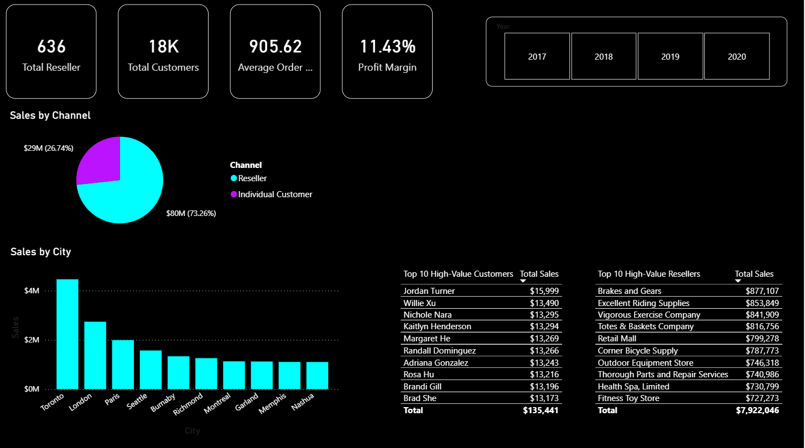
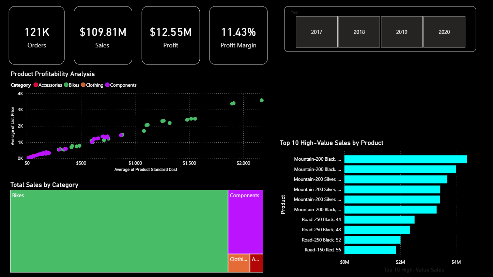

# AdventureWorks Enterprise Sales Performance Dashboard 📊💼

## 📌 Project Overview
This project features a multi-page, enterprise-grade Power BI sales dashboard analyzed using the famous **AdventureWorks** dataset. The dashboard provides comprehensive insights across three specialized dimensions: Executive Summary, Customer vs. Reseller Insights, and Product Performance, empowering business stakeholders to optimize global sales strategies.

## 🛠️ Tools & Technologies Used
* **Data Visualization & Analytics:** Power BI Desktop.
* **Calculations & Business Logic:** DAX (Data Analysis Expressions) for creating advanced KPIs, Year-over-Year calculations, and margin metrics.
* **Theme & UI Design:** Custom High-Contrast Dark Theme for executive reporting.

## 📁 Dashboard Structure & Pages
1. **Executive Summary:** Focuses on high-level enterprise metrics including Total Orders (121K), Total Sales ($109.81M), Total Profits ($12.55M), and global geographic performance using interactive map visuals.
2. **Customer vs. Reseller Insights:** Drills down into sales channels, highlighting that **Resellers** drive the majority of revenue (**73.26%** / $80M). It also ranks Top 10 High-Value Customers and Resellers.
3. **Product Performance:** Analyzes product profitability using scatter plots and tree-maps, identifying **Bikes** as the primary revenue and margin driver for the business.

## 📊 Key Insights & Business Findings
* **Revenue Drivers:** The enterprise has successfully crossed **$109.81M in Total Sales** with a healthy **Profit Margin of 11.43%**.
* **Channel Strategy:** Reseller partnerships are the backbone of revenue distribution, contributing **73.26%** of overall sales compared to individual direct customers.
* **Geographic Leadership:** **North America** represents the highest density of sales volume and total revenue across global markets.
* **Product Mix Profitability:** The product portfolio analysis reveals that **Bikes (specifically the Mountain-200 series)** are the top high-value sales generation engine.

## 🖼️ Dashboard Preview
### Page 1: Executive Summary

### Page 2: Customer vs. Reseller Insights

### Page 3: Product Performance

## 📐 Data Architecture & Model

The project follows a clean data modeling approach to ensure high performance:

## 📂 Project Structure
* `/AdventureWorks_Sales_Analysis.pbix` - The core multi-page Power BI project file.
* `/images/` - Directory containing page screenshots for presentation.
* `README.md` - Project documentation.
